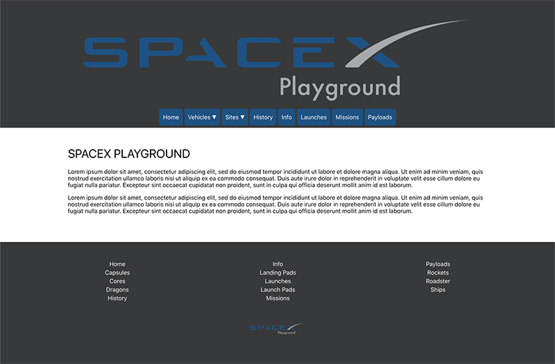
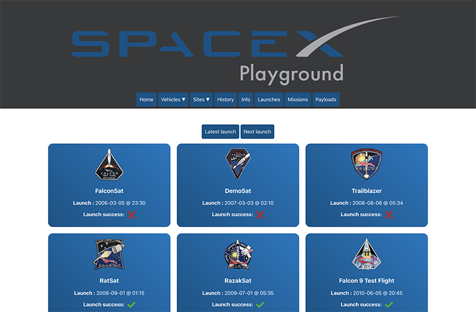
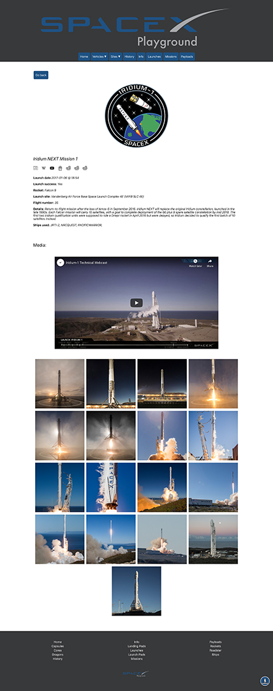

# spacex-playground
Browse data from the Space X API

## Instructions:
0. clone the project and cd into the root of the project
1. npm install
2. npm run start (or npm run restart to automatically restart on changes)
3. open another terminal windown
4. cd into the root of the project
5. cd client
6. npm start

## Screenshots

